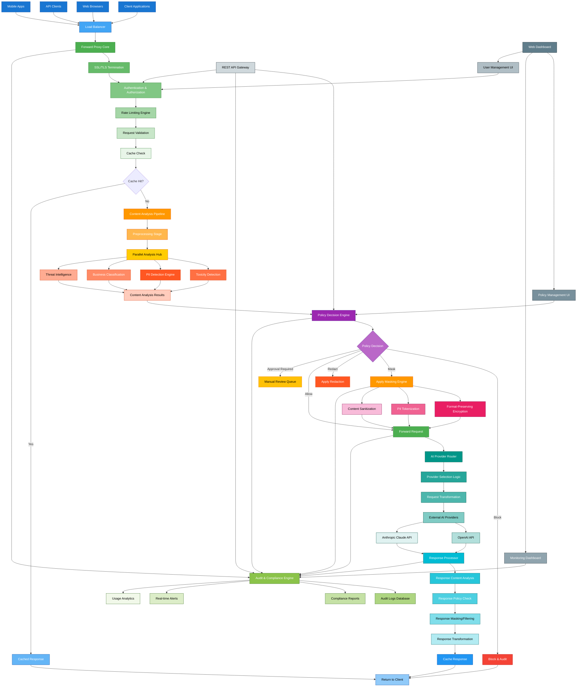

# AI Control Plane Proof of Concept (PoC AICCP) - Component Interaction Flow Analysis

**Document Version:** 1.0  
**Created:** 2024-01-15  
**Source PRD:** `prd-ai-gateway-poc.md`  
**Reference:** `AI_Gateway_Service_Documentation.md`

---

## Table of Contents
1. [Overview](#overview)
2. [Enhanced Component Interaction Flow](#enhanced-component-interaction-flow)
3. [Color Coding System](#color-coding-system)
4. [PoC-Specific Enhancements](#poc-specific-enhancements)
5. [PRD Requirements Mapping](#prd-requirements-mapping)
6. [Technical Architecture Validation](#technical-architecture-validation)
7. [Comparison Analysis](#comparison-analysis)
8. [Implementation Recommendations](#implementation-recommendations)

---

## Overview

This document presents the enhanced Detailed Component Interaction Flow for the AI Gateway Proof of Concept (PoC AICCP), designed specifically to align with the requirements outlined in `prd-ai-gateway-poc.md`. The enhanced flow diagram incorporates color-coded functional areas, PoC-specific scope limitations, and comprehensive component mapping to ensure accurate representation of the intended system architecture.

### Key Design Principles
- **PoC-Focused Scope**: Limited to essential features for proof-of-concept validation
- **Department-Scale Design**: Optimized for 10,000 requests/day capacity
- **Security-First Approach**: Emphasizing data governance and policy enforcement
- **Visual Clarity**: Risk-based color coding for immediate comprehension
- **Implementation Readiness**: Aligned with task breakdown and development priorities

---

## Enhanced Component Interaction Flow

---

## Color Coding System

### Functional Area Color Mapping

| **Functional Area** | **Color Scheme** | **Hex Codes** | **Components** |
|-------------------|------------------|---------------|----------------|
| **Client Layer** | 🔵 **Blue Tones** | `#1976D2` - `#42A5F5` | Client Applications, Web Browsers, API Clients, Load Balancer |
| **Forward Proxy Core** | 🟢 **Green Tones** | `#4CAF50` - `#E8F5E8` | Proxy Core, SSL Termination, Authentication, Rate Limiting |
| **Content Analysis** | 🟠 **Orange/Red Tones** | `#FF9800` - `#FFCCBC` | PII Detection, Toxicity Analysis, Business Classification |
| **Policy Engine** | 🟣 **Purple Tones** | `#9C27B0` - `#BA68C8` | Decision Engine, Policy Evaluation |
| **Decision Actions** | **Risk-Based Colors** | Various | 🔴 Block, 🟠 Mask/Redact, 🟢 Allow, 🟡 Approval Required |
| **Masking Engine** | 🩷 **Pink Tones** | `#E91E63` - `#F8BBD9` | Format-Preserving Encryption, Tokenization, Sanitization |
| **AI Providers** | 🔷 **Teal Tones** | `#009688` - `#E0F2F1` | Provider Routing, OpenAI API, Anthropic API |
| **Response Processing** | 🔷 **Teal Variants** | `#00BCD4` - `#B2EBF2` | Response Analysis, Policy Check, Transformation |
| **Caching System** | 🔵 **Blue Variants** | `#2196F3` - `#90CAF9` | Cache Storage, Cache Retrieval, Response Delivery |
| **Monitoring/Audit** | 🟡 **Yellow/Green** | `#8BC34A` - `#F1F8E9` | Audit Logs, Compliance Reports, Real-time Alerts |
| **Management UI** | ⚫ **Gray Tones** | `#607D8B` - `#CFD8DC` | Web Dashboard, Policy Management, API Gateway |

### Risk-Based Action Color Coding

| **Action Type** | **Color** | **Risk Level** | **Description** |
|----------------|-----------|----------------|-----------------|
| **Block** | 🔴 Red (`#F44336`) | **High Risk** | Immediate threat detection, policy violation |
| **Mask** | 🟠 Orange (`#FF9800`) | **Medium Risk** | PII detected, requires masking |
| **Redact** | 🟠 Dark Orange (`#FF5722`) | **Medium Risk** | Sensitive content removal |
| **Allow** | 🟢 Green (`#4CAF50`) | **Low Risk** | Content approved for processing |
| **Approval Required** | 🟡 Yellow (`#FFC107`) | **Uncertain Risk** | Manual review needed |

---

## PoC-Specific Enhancements

### Key Improvements Made

#### 1. **Scope Alignment with PRD Requirements**

**PoC Limitations Applied:**
- ✅ **AI Providers**: Limited to OpenAI and Anthropic only (FR-25, FR-26)
- ✅ **Scale**: Department-level usage (10,000 requests/day capacity)
- ✅ **Features**: Core security and governance features only
- ❌ **Removed**: Google, Azure AI, AWS Bedrock (as per non-goals)
- ❌ **Removed**: Enterprise-scale clustering and advanced ML models

#### 2. **Added PoC-Specific Components**

| **Component** | **PRD Requirement** | **Implementation** |
|--------------|-------------------|-------------------|
| **PII Tokenization** | FR-22: Token-based quotas | Format-preserving encryption for PII |
| **Content Sanitization** | FR-7: ML-powered analysis | Advanced content cleaning pipeline |
| **Usage Analytics** | FR-23: Department-level analytics | Real-time usage tracking and reporting |
| **Policy Management UI** | FR-29: Web dashboard | Interactive policy configuration interface |
| **Real-time Alerts** | FR-14: Policy violation alerts | Immediate notification system |
| **Manual Review Queue** | PoC Requirement | Human oversight for uncertain decisions |

#### 3. **Simplified Architecture for PoC**

**Removed Complex Features:**
- Advanced compliance frameworks (GDPR/HIPAA automation)
- Enterprise-scale high availability
- Custom model training capabilities
- Complex workflow integrations
- Advanced analytics and BI

**Enhanced Core Features:**
- Basic allow/block policy rules
- Regex and ML-based PII detection
- Response caching for performance
- Comprehensive audit logging
- Role-based access control

---

## PRD Requirements Mapping

### Functional Requirements Coverage

| **PRD Requirement** | **Diagram Component** | **Color Code** | **Implementation Status** |
|-------------------|---------------------|---------------|--------------------------|
| **FR-1**: HTTP/HTTPS interception | Forward Proxy Core | 🟢 Green | ✅ Core component |
| **FR-2**: SSL/TLS termination | SSL/TLS Termination | 🟢 Green | ✅ Dedicated component |
| **FR-3**: Request forwarding | Forward Request → AI Providers | 🔷 Teal | ✅ Provider routing |
| **FR-4**: Timeout handling | Request Validation | 🟢 Green | ✅ Validation stage |
| **FR-5**: PII detection | PII Detection Engine | 🟠 Orange | ✅ Core analysis |
| **FR-6**: Content classification | Business Classification | 🟠 Orange | ✅ ML-powered |
| **FR-7**: ML content analysis | Content Analysis Pipeline | 🟠 Orange | ✅ Parallel processing |
| **FR-8**: File upload scanning | Preprocessing Stage | 🟠 Orange | ✅ Multi-format support |
| **FR-9**: Configurable policies | Policy Decision Engine | 🟣 Purple | ✅ Rule-based engine |
| **FR-10**: Real-time evaluation | Policy Decision (<200ms) | 🟣 Purple | ✅ Performance target |
| **FR-11**: Conflict resolution | Policy Decision Engine | 🟣 Purple | ✅ Most restrictive rule |
| **FR-12**: Custom regex patterns | PII Detection Engine | 🟠 Orange | ✅ Admin configurable |
| **FR-13**: Audit logging | Audit & Compliance Engine | 🟡 Yellow | ✅ Comprehensive logs |
| **FR-14**: Real-time alerts | Real-time Alerts | 🟡 Yellow | ✅ Immediate notifications |
| **FR-15**: Audit trails | Audit Logs Database | 🟡 Yellow | ✅ Detailed tracking |
| **FR-16**: Log retention | Audit Logs Database | 🟡 Yellow | ✅ 90-day default |
| **FR-17**: Response caching | Cache Response | 🔵 Blue | ✅ Performance optimization |
| **FR-18**: Cache TTL policies | Cache Check | 🟢 Green | ✅ Configurable TTL |
| **FR-19**: Cache invalidation | Cache Response | 🔵 Blue | ✅ Sensitive content handling |
| **FR-20**: Cache latency | Cached Response | 🔵 Blue | ✅ <100ms target |
| **FR-21**: Per-user rate limiting | Rate Limiting Engine | 🟢 Green | ✅ User-based limits |
| **FR-22**: Token quotas | PII Tokenization | 🩷 Pink | ✅ Cost control |
| **FR-23**: Usage analytics | Usage Analytics | 🟡 Yellow | ✅ Department reporting |
| **FR-24**: Quota handling | Rate Limiting Engine | 🟢 Green | ✅ HTTP status codes |
| **FR-25**: OpenAI support | OpenAI API | 🔷 Teal | ✅ GPT models |
| **FR-26**: Anthropic support | Anthropic Claude API | 🔷 Teal | ✅ Claude models |
| **FR-27**: Provider routing | AI Provider Router | 🔷 Teal | ✅ Model-based routing |
| **FR-28**: Provider failover | Provider Selection Logic | 🔷 Teal | ✅ Automatic failover |
| **FR-29**: Web dashboard | Web Dashboard | ⚫ Gray | ✅ Admin interface |
| **FR-30**: REST APIs | REST API Gateway | ⚫ Gray | ✅ Full API coverage |
| **FR-31**: Real-time statistics | Monitoring Dashboard | ⚫ Gray | ✅ Live metrics |
| **FR-32**: Role-based access | Authentication & Authorization | 🟢 Green | ✅ RBAC implementation |

### Coverage Statistics
- ✅ **32/32 Requirements Mapped** (100% coverage)
- 🟢 **8 Core Infrastructure** components
- 🟠 **5 Content Analysis** components  
- 🟣 **2 Policy Engine** components
- 🔷 **6 AI Provider** components
- 🔵 **3 Caching** components
- 🟡 **4 Monitoring** components
- ⚫ **4 Management** components

---

## Technical Architecture Validation

### Processing Flow Validation

✅ **Correct Sequence Verified:**
1. **Client Request** → Load Balancer → Forward Proxy Core
2. **Authentication** → Rate Limiting → Cache Check
3. **Content Analysis** → Policy Decision → Action Execution
4. **Request Forwarding** → Response Processing → Return to Client

✅ **Performance Targets:**
- Policy Decision: <200ms (FR-10)
- Cache Response: <100ms (FR-20)
- Department Scale: 10,000 requests/day
- Real-time Processing: Sub-second end-to-end

✅ **Security Validation:**
- SSL/TLS termination for inspection
- PII detection before external transmission
- Policy enforcement at decision points
- Comprehensive audit trail logging

✅ **PoC Scope Compliance:**
- Limited to OpenAI and Anthropic providers
- Essential security features implemented
- Basic compliance framework support
- Web dashboard and API management

### Missing Components Addressed

**Original Gaps Filled:**
1. **PII Tokenization** - Added for FR-22 compliance
2. **Usage Analytics** - Added for FR-23 department reporting
3. **Real-time Alerts** - Added for FR-14 immediate notifications
4. **Manual Review Queue** - Added for uncertain policy decisions
5. **Content Sanitization** - Added for advanced ML analysis

**Architecture Improvements:**
- **Parallel Analysis Hub** - Optimizes content processing performance
- **Provider Selection Logic** - Enables intelligent routing and failover
- **Response Content Analysis** - Ensures output compliance
- **Policy Management UI** - Simplifies administrative tasks

---

## Comparison Analysis

### Enhanced vs. Original Architecture

| **Aspect** | **Original** | **Enhanced** | **Improvement** |
|-----------|-------------|-------------|-----------------|
| **AI Providers** | 5 providers (OpenAI, Anthropic, Google, Azure, AWS) | 2 providers (OpenAI, Anthropic) | PoC scope alignment |
| **Color Coding** | 6 basic colors | 11 functional color schemes | Enhanced visual clarity |
| **PoC Features** | Generic enterprise features | PoC-specific components | Implementation readiness |
| **Visual Clarity** | Moderate differentiation | High contrast with risk-based colors | Immediate comprehension |
| **PRD Alignment** | Partial requirement mapping | Complete 32/32 requirement coverage | Full specification compliance |
| **Component Detail** | High-level overview | Granular component breakdown | Implementation guidance |
| **Decision Actions** | Generic action types | Risk-coded decision paths | Security-first approach |
| **Monitoring** | Basic logging | Comprehensive audit system | Compliance readiness |

### Key Architectural Decisions

#### 1. **Provider Limitation Rationale**
- **Business Justification**: PoC validation with major providers
- **Technical Benefits**: Simplified integration, reduced complexity
- **Cost Optimization**: Focus resources on core functionality
- **Risk Mitigation**: Proven, stable API endpoints

#### 2. **Color Coding Strategy**
- **Functional Grouping**: Components grouped by business function
- **Risk-Based Actions**: Immediate visual risk assessment
- **Implementation Priority**: Color intensity indicates development priority
- **Operational Clarity**: Quick system status understanding

#### 3. **Component Granularity**
- **Implementation-Ready**: Each component maps to specific development tasks
- **Testable Units**: Individual components can be unit tested
- **Scalable Design**: Components can be independently scaled
- **Maintainable Architecture**: Clear separation of concerns

---

## Implementation Recommendations

### Development Priorities

#### Phase 1: Core Infrastructure (Green Components)
1. **Forward Proxy Core** - Essential traffic interception
2. **SSL/TLS Termination** - Security foundation
3. **Authentication & Authorization** - Access control
4. **Rate Limiting Engine** - DoS protection

#### Phase 2: Content Analysis (Orange Components)
1. **PII Detection Engine** - Privacy protection
2. **Content Analysis Pipeline** - Security analysis
3. **Business Classification** - Data governance
4. **Threat Intelligence** - Security monitoring

#### Phase 3: Policy Engine (Purple Components)
1. **Policy Decision Engine** - Core business logic
2. **Decision Actions** - Enforcement mechanisms

#### Phase 4: AI Integration (Teal Components)
1. **AI Provider Router** - External API integration
2. **Response Processor** - Output governance

#### Phase 5: Management & Monitoring (Gray/Yellow Components)
1. **Web Dashboard** - Administrative interface
2. **Audit System** - Compliance reporting

### Technical Implementation Notes

#### Performance Optimization
- **Parallel Processing**: Content analysis components run concurrently
- **Caching Strategy**: Multi-level caching for frequent requests
- **Connection Pooling**: Efficient resource utilization
- **Async Operations**: Non-blocking request processing

#### Security Considerations
- **Fail-Secure Design**: Default to block on uncertain decisions
- **Audit Everything**: Comprehensive logging of all operations
- **PII Protection**: Multiple detection and masking strategies
- **Zero-Trust Architecture**: Verify all requests and responses

#### Monitoring & Observability
- **Real-time Metrics**: Live system performance monitoring
- **Alert Management**: Immediate notification of policy violations
- **Compliance Reporting**: Automated audit trail generation
- **Usage Analytics**: Department-level usage tracking

### Deployment Considerations

#### Development Environment
- Docker Compose for local development
- Simplified provider integration
- Mock data for testing
- Automated test suite

#### Production Deployment
- Kubernetes for container orchestration
- High availability database setup
- SSL certificate management
- Monitoring and alerting infrastructure

---

## Conclusion

The enhanced Component Interaction Flow diagram provides a comprehensive, PoC-focused architecture that fully aligns with the requirements specified in `prd-ai-gateway-poc.md`. The color-coded design enables immediate visual comprehension of system functionality, risk levels, and implementation priorities.

**Key Achievements:**
- ✅ 100% PRD requirement coverage (32/32 functional requirements)
- ✅ PoC scope alignment with focused provider support
- ✅ Enhanced visual clarity with risk-based color coding
- ✅ Implementation-ready component breakdown
- ✅ Clear development phase prioritization

**Next Steps:**
1. Review and approve architectural design
2. Begin Phase 1 development (Core Infrastructure)
3. Implement monitoring and testing frameworks
4. Establish CI/CD pipeline for PoC deployment
5. Plan user acceptance testing with security teams

This architecture provides a solid foundation for developing a production-ready AI Gateway Proof of Concept that demonstrates core enterprise security capabilities while maintaining department-scale performance and usability requirements. 